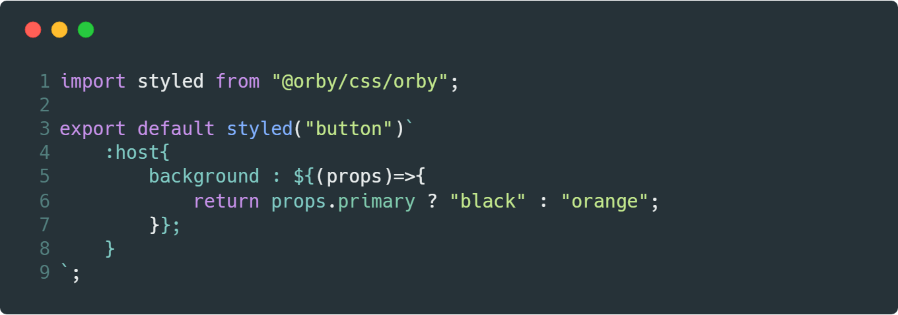

# @orby/css

`@orby/css `permite mantener el control y alcance del estilo asociado al componentes a base de JSX, **con solo 1.9kB de tamaño**.



El efecto de contexto dinámico sucede gracias al uso de las [Custom properties ](https://developer.mozilla.org/en-US/docs/Web/CSS/--*), cada función será remplazada por una variable asociada solo al className.

## Índice

1. [Funcionamiento](#funcionamiento)
2. [Motivacion](#motivacion)
3. [Estilos estaticos](#estilos-estaticos)
4. [Estilos dinamicos](#estilos-dinamicos)
5. [Selectores especiales](#selectores-especiales)
    1. [Selector host](#selector-host)
    2. [Selector global](#selector-global)
6. [Keyframes](#keyframes)
8. Ejemplos
    1. [Orby](https://codesandbox.io/s/v108q231zl)
    2. [Preact](https://codesandbox.io/s/ql6zl4w4rj)
    3. [React](https://codesandbox.io/s/jj1jjv1x2w)


## Motivacion

Hoy existen una gran cantidad de herramientas(styled-components, emotion y otras) que buscan solucionar la problemática de encapsulación de estilo y lo logran de forma excelente, pero tal solución se aleja de lo que hoy el css nos ofrece como semántica dentro del shadow-dom, por ejemplo en uso del selector [:host](https://developer.mozilla.org/en-US/docs/Web/CSS/:host())

```css
:host{
  font-weight: bold;
}
```

Con `@orby/css`  busco que ud no se aleje de la semántica tradicional del CSS, Esta es cumple con el objetivo y es la que ud necesita para crear estilos de componentes. el estilo para un componente es  y debe ser simple, si ud va a crear componentes quizás no requiera sass o less para decorar sus estilos. lo invito a redescubrir lo simple y practico del css tradicional en tiempos modernos.

> Piense en orby como una pequeña implementación del css asociado con shadow-dom, pero sin el costo de shadow-dom.

## Estilos estáticos

Los estilos estáticos son todas las reglas que no incorporen el uso de funciones para la definición de propiedades.

```jsx
styled("button")`
    :host{
        background:${COLOR}
    }
`
```
> la constante `${COLOR}`al no ser una función, la regla se considera estática, por lo que solo la imprimirá una vez y antes de montar el mismo componente.

## Estilos dinámicos
Los estilos dinámicos son todas las reglas que incorporan el uso de funciones en la definición de propiedades.

```jsx
styled("button")`
    :host{
        background:${(props)=>{
            return props.primary ? "black" : "orange";
        }}
    }
`
```
> `@orby/css` remplaza las funciones dentro del estilo por [custom-properties](https://developer.mozilla.org/en-US/docs/Web/CSS/--*)

## Selectores especiales

Para facilitar la impresión de estilos `@orby/css`, hace uso de  selectores especiales: 

1. `:host`:  permite apuntar a la misma clase, sea estática o dinámica.
2. `:global` : permite escapar el contexto de alcance del componente

### selector host

Este selector permite apuntar al componente en si, ud puede generar las siguientes confinaciones propuestas:

```css
:host(.selector-1){}
:host(:checked){}

:host(.selector-1,.selector-2,.selector-3){}
:host(.selector-1:not(.selector-2)){}

:host.selector-1{}
:host:checked{}

:host[data-any]{}
```

> Pueden existir mas confinaciones, ya que `@orby/css` solo remplaza `:host` por un nombre de clase, he intentado homologar el comportamiento de `:host` propuesto en el uso de shadow-dom [ver más](https://developer.mozilla.org/en-US/docs/Web/CSS/:host()).


### selector global

Este selector permite escapar del contexto local

```css
:global(body){}
```

Esta también permite el uso de múltiples argumentos `:globla(a,button,.any)`

## Keyframes

Para mantener la animaciones keyframes  `@orby/css` prefija todas los nombre de animación con el nombre de clase, de esta forma el keyframes generado mantiene su efecto solo dentro del contexto del componente.

```jsx
let Rotate = styled("div")`
    :host{
        animation : rotate 1s  infinite;
    }
    @keyframes rotate{
        0%{
            transform:rotate(0deg);
        }
        100%{
            transform:rotate(360deg);
        }
    }
`;
```

## parse 

para poder procesar las reglas he creado un pequeño script capas de transformar el css en un objeto similar al que retorna [postcss](https://postcss.org/). en tan solo 855 B.

```js
import parse from "@orby/css/parse";

let css = `
    @media (max-width:320px){
        button:not(.sample){
            color : black;
        }
    }
`;

parse(css)
```
El retorno de esto es un objeto sumamente enriquecido, ideal para la construcción de reglas o lectura de propiedades.
```js
[
    {
        selector: "@media (max-width:320px)",
        type: "media",
        value: "(max-width:320px)",
        children: [
            {
                selector: "button:not(.sample)",
                children: [],
                type: "selector",
                properties: [{ index: "color", value: "black" }],
                selectors: [
                    [
                        { value: "button", args: [] },
                        { value: ":not", args: [".sample"] }
                    ]
                ]
            }
        ],
        properties: []
    }
];
```
